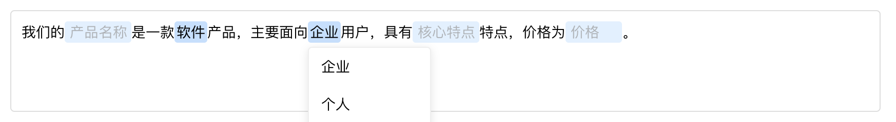

# RichInput 智能输入组件

一个基于 Vue 3 的智能富文本输入组件，支持模板化输入、动态字段编辑和下拉选择功能。

## 🚀 组件概述

### 组件效果预览



### 主要功能

RichInput 是一个高度可配置的智能输入组件，专为需要结构化输入的场景设计。它将传统的表单输入转换为更直观的模板化编辑体验。

### 适用场景

- **内容模板编辑**：如邮件模板、文档模板、消息模板等
- **结构化数据输入**：需要按特定格式输入数据的表单
- **智能提示输入**：需要提供预设选项的输入场景
- **动态表单构建**：根据配置动态生成的表单字段

### 关键特性

- ✨ **模板化输入**：支持 `{fieldName}` 占位符语法
- 🎯 **双字段类型**：支持自由输入（input）和下拉选择（select）
- 🎨 **可视化编辑**：高亮显示可编辑区域，直观的用户体验
- 📱 **响应式设计**：自适应布局，支持移动端
- 🔧 **高度可配置**：灵活的配置选项，满足不同业务需求
- 🎪 **智能定位**：下拉菜单自动边界检测和位置调整
- 🖱️ **交互友好**：支持点击外部区域自动隐藏下拉菜单

## 📦 安装指南

### 环境要求

- **Node.js**: >= 16.0.0
- **Vue**: >= 3.4.0
- **TypeScript**: >= 5.0.0 (可选，但推荐)

### 安装依赖

```bash
# 使用 npm
npm install vue@^3.4.15

# 使用 yarn
yarn add vue@^3.4.15

# 使用 pnpm
pnpm add vue@^3.4.15
```

### 项目依赖

组件依赖以下核心包：

```json
{
  "vue": "^3.4.15",
  "typescript": "~5.3.3"
}
```

## 📖 使用说明

### 基础用法

```vue
<template>
  <div>
    <RichInput :config="inputConfig" />
  </div>
</template>

<script setup lang="ts">
import RichInput from './components/RichInput.vue'
import type { RichInputConfig } from './components/RichInput.vue'

// 基础配置示例
const inputConfig: RichInputConfig = {
  template: "我是一名{role}需要写一篇关于{topic}的{format}。面向{audience}宣传产品。",
  fields: {
    role: { 
      type: 'input', 
      placeholder: '公众号博主', 
      defaultValue: '公众号博主' 
    },
    topic: { 
      type: 'select', 
      options: ['科技', '教育', '健康'], 
      defaultValue: '[主题]' 
    },
    format: { 
      type: 'select', 
      options: ['文章', '报告', '论文'], 
      defaultValue: '文章' 
    },
    audience: { 
      type: 'input', 
      placeholder: '[人群]', 
      defaultValue: '' 
    }
  }
}
</script>
```

### 高级用法

```vue
<template>
  <div>
    <!-- 自定义配置 -->
    <RichInput :config="customConfig" />
    
    <!-- 邮件模板示例 -->
    <RichInput :config="emailConfig" />
  </div>
</template>

<script setup lang="ts">
// 自定义业务场景配置
const customConfig = {
  template: "尊敬的{customerName}，您的{orderType}订单已{status}，预计{deliveryTime}送达。",
  fields: {
    customerName: {
      type: 'input',
      placeholder: '客户姓名',
      defaultValue: ''
    },
    orderType: {
      type: 'select',
      options: ['普通订单', '加急订单', '预售订单'],
      defaultValue: '普通订单'
    },
    status: {
      type: 'select',
      options: ['已确认', '已发货', '配送中'],
      defaultValue: '已确认'
    },
    deliveryTime: {
      type: 'input',
      placeholder: '送达时间',
      defaultValue: '2-3个工作日'
    }
  }
}

// 邮件模板配置
const emailConfig = {
  template: "Hi {name}, welcome to {platform}! Your {accountType} account is ready.",
  fields: {
    name: {
      type: 'input',
      placeholder: 'User Name',
      defaultValue: ''
    },
    platform: {
      type: 'input',
      placeholder: 'Platform Name',
      defaultValue: 'Our Platform'
    },
    accountType: {
      type: 'select',
      options: ['Basic', 'Premium', 'Enterprise'],
      defaultValue: 'Basic'
    }
  }
}
</script>
```

### 配置参数说明

#### RichInputConfig 接口

```typescript
interface RichInputConfig {
  template: string                    // 模板字符串，使用 {fieldName} 作为占位符
  fields: Record<string, Field>       // 字段配置映射
}
```

#### Field 类型定义

```typescript
// 输入字段
interface InputField {
  type: 'input'
  placeholder: string    // 占位符文本
  defaultValue: string   // 默认值
}

// 选择字段
interface SelectField {
  type: 'select'
  options: string[]      // 可选项列表
  defaultValue: string   // 默认选中值
}

type Field = InputField | SelectField
```

#### 参数详解

| 参数 | 类型 | 必填 | 默认值 | 说明 |
|------|------|------|--------|------|
| `config.template` | `string` | 是 | - | 模板字符串，使用 `{fieldName}` 定义可编辑区域 |
| `config.fields` | `Record<string, Field>` | 是 | - | 字段配置对象，key 对应模板中的占位符名称 |
| `field.type` | `'input' \| 'select'` | 是 | - | 字段类型：input 为文本输入，select 为下拉选择 |
| `field.placeholder` | `string` | 是 | - | 占位符文本（input 类型）|
| `field.options` | `string[]` | 是* | - | 可选项列表（select 类型必填）|
| `field.defaultValue` | `string` | 否 | `''` | 字段默认值 |

## ⚠️ 注意事项

### 使用限制

1. **占位符命名**：模板中的占位符名称必须与 `fields` 配置中的 key 完全匹配
2. **字段类型**：每个字段必须明确指定 `type` 为 `'input'` 或 `'select'`
3. **选择字段**：`select` 类型字段必须提供 `options` 数组
4. **模板格式**：占位符必须使用 `{fieldName}` 格式，不支持嵌套或复杂表达式

### 常见问题解决

#### Q: 下拉菜单不显示？
**A**: 检查以下几点：
- 确保字段配置中 `type: 'select'`
- 确保提供了 `options` 数组且不为空
- 检查模板中占位符名称是否与字段 key 匹配

#### Q: 输入框无法编辑？
**A**: 可能的原因：
- 字段类型设置为 `'select'` 而非 `'input'`
- 浏览器禁用了 `contenteditable` 功能
- CSS 样式冲突导致元素不可点击

#### Q: 样式显示异常？
**A**: 解决方案：
- 确保组件的 scoped 样式不与全局样式冲突
- 检查是否有其他 CSS 框架影响组件样式
- 可以通过自定义 CSS 变量覆盖默认样式

#### Q: 在移动端体验不佳？
**A**: 优化建议：
- 增加触摸区域大小（调整 padding）
- 适配移动端的字体大小
- 考虑使用原生 select 元素替代自定义下拉菜单

### 性能优化建议

1. **大量选项**：当 select 字段选项超过 100 个时，建议实现虚拟滚动
2. **复杂模板**：避免在模板中使用过多字段（建议不超过 20 个）
3. **频繁更新**：如需频繁更新配置，考虑使用 `shallowRef` 优化性能

## 🤝 贡献指南

### 参与改进

我们欢迎社区贡献！以下是参与项目的方式：

#### 开发环境设置

```bash
# 克隆项目
git clone <repository-url>
cd rich-input

# 安装依赖
npm install

# 启动开发服务器
npm run dev

# 运行类型检查
npm run check

# 运行代码检查
npm run lint
```

#### 贡献流程

1. **Fork 项目**到你的 GitHub 账户
2. **创建特性分支**：`git checkout -b feature/amazing-feature`
3. **提交更改**：`git commit -m 'Add some amazing feature'`
4. **推送分支**：`git push origin feature/amazing-feature`
5. **创建 Pull Request**

#### 代码规范

- 遵循 ESLint 配置规则
- 使用 TypeScript 进行类型定义
- 添加适当的注释和文档
- 确保所有测试通过

### 问题反馈

#### 报告 Bug

在提交 Bug 报告时，请包含以下信息：

- **环境信息**：Node.js 版本、Vue 版本、浏览器版本
- **重现步骤**：详细的操作步骤
- **期望行为**：你期望发生什么
- **实际行为**：实际发生了什么
- **相关代码**：最小化的重现代码

#### 功能请求

提交功能请求时，请说明：

- **使用场景**：为什么需要这个功能
- **期望行为**：功能应该如何工作
- **替代方案**：是否考虑过其他解决方案

#### 联系方式

- **GitHub Issues**：[项目 Issues 页面]
- **讨论区**：[GitHub Discussions]
- **邮件**：[维护者邮箱]

---

## 📄 许可证

本项目采用 MIT 许可证。详情请参阅 [LICENSE](LICENSE) 文件。

## 🙏 致谢

感谢所有为这个项目做出贡献的开发者和用户！

---

**Happy Coding! 🎉**